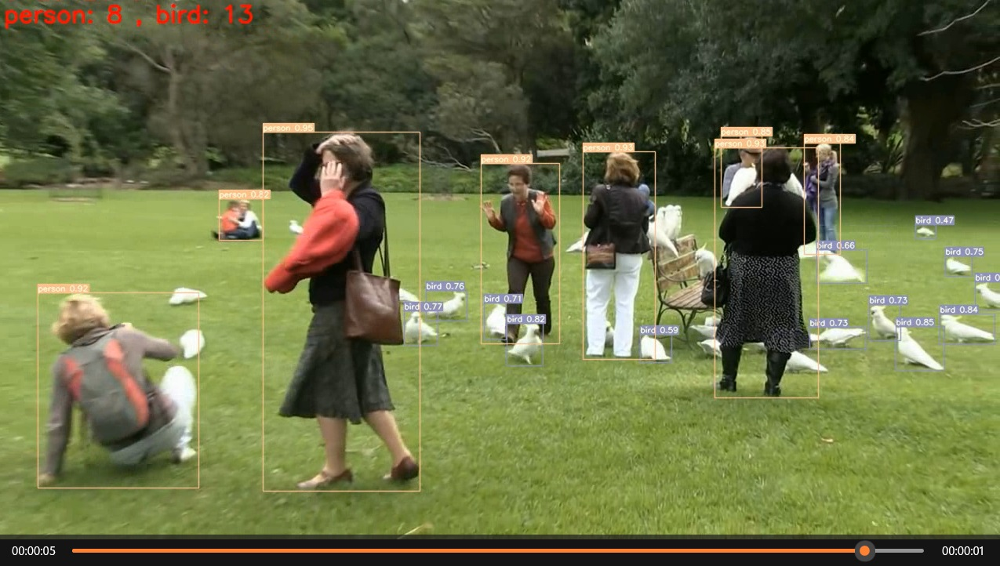

# yolov7_detect_person_bird
 yolo test

You need to change the your own object classes and names first in anchors and predict.py according to your need.
Training result prediction requires the use of two files, namely yolo.py and predict.py.

    
<button onclick="copyCode()">Copy code</button>

<pre><code id="code" class="language-python">
python train.py ...
python detect_v2.py ...
</code></pre>

# demo example

# Reference
https://github.com/WongKinYiu/yolov7.git

